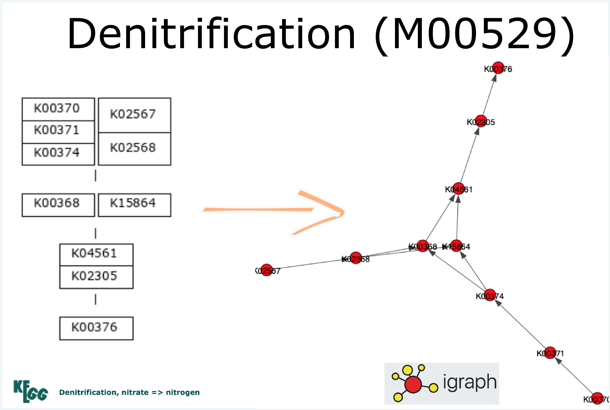

# Metabolic Pathway Finder

This program reveals uses KEGG definitions from the genome.jp database to identify the presence/absence of metabolisms across genomes. Prerequisites to using this program include using Prodigal to identify open-reading frames (ORFs) in metagenomic data and annotating these open reading frames using the KEGG database. To make life easier, we simply used the anvio environment to do the above as it also gave us a really functional interface that we used to bin the DNA into metagenome-assembled genomes (MAGs) (optional for this code). Once this was done, we extracted data from the anvio PROFILE and CONTIGS databases in which we stored our bins. It should look somewhat like this:

#### head(misc data table)

This is simply used as input to this code and the filepaths can be edited in lines `13-14` of the `metabolism_detect.py` file. 

## How does this work?

This metabolism pathway detection goes beyond the simple absence/presence of annotation softwares. Each metabolism is comprised of many genes that each code for a protein which serves as an intermediary/substrate/reactant all of whom come together to take a metabolism from start to finish. If every metabolism was a simple linear assembly line, this code would be fairly useless and overly complex as a simple excel-tally macro would get the job done. However, evolution has made the job so much more exciting. Evolution has allowed metabolisms like Vitamin B12 synthesis diverge to having alternate pathways (<a href="https://www.genome.jp/module/M00925">aerobic</a> vs <a href = "https://www.genome.jp/module/M00924">anaerobic</a>). 

These alternate pathways allow for the same metabolism to be conducted in different environmental conditions, in this case across a range of oxygen environments. Similarly, evolution has allowed for degeneracy across metabolic intermediates where different genes could encode for the same protein OR different protein-intermediates could achieve the same metabolism. This makes the question of whether a metabolism exists in a genome a lot harder. 

## Graphical approach to metabolisms
What I employ here is a graph based simple paths approach. Each metabolism has a KEGG definition. I parse this definition to generate a graph connecting all the genes in a metabolic pathway. From this graph (using <a href="https://igraph.org/python/api/0.9.8/igraph._igraph.GraphBase.html">iGraph</a>). Using g.get_all_simple_paths(), I can then get every possible path from the first genes to the final genes of the pathway. Let's take the denitrification pathway (M00529). 

The graph by KEGG is simply their representation of the definition which is:
(K00370+K00371+K00374,K02567+K02568) (K00368,K15864) (K04561+K02305) K00376*

I set it up as the red-noded graph in igraph and from there generate all possible paths from the source nodes (K00370, K02567) to the target nodes (K00376). In this specific metabolism, there are four possible pathways of genes which if present indicates that a genome may carry out denitrification:
<ul>
<li>['K02567', 'K02568', 'K00368', 'K04561', 'K02305', 'K00376']</li>

<li>['K02567', 'K02568', 'K15864', 'K04561', 'K02305', 'K00376']</li>

<li>['K00370', 'K00371', 'K00374', 'K00368', 'K04561', 'K02305', 'K00376']</li>

<li>['K00370', 'K00371', 'K00374', 'K15864', 'K04561', 'K02305', 'K00376']</li>
</ul>

## Missing threshholds
From here, we just need to see if all the genes in any of these pathways are present. Simple! However, a lot of our research is conducted in novel environments where the products of evolution are yet to be explored. Perhaps the gene homologous to K00370 (narG, narZ, nxrA) in the denitrification pathway occuring in Pacific Northwest seagrass rhizomes has evolved to such a state that it won't be picked up by KEGG's gene annotation software. In this case, the genome <i>can</i> denitrify nitrate but our software would fail as it wouldn't pick up the gene doing K00370's job. I account for this by allowing the user to set their own threshhold percentage of genes that they allow missing in a pathway. 

For example: I set a threshhold allowing for at most 25% of genes missing (DEFAULT). In the last pathway above, the length is 7 genes (n = 7). So this threshold would allow at most 1 gene (m = 1) to be absent (1.75 gets rounded down to 1 to stay conservative!) This floor function tends to make this program sensitive to pathways of smaller lengths (if n = 2, m = 0) and more allowing towards pathways of longer lengths (n = 15, m = 3). Keep this in mind when interpreting your data!

<ul>
<li>`threshold = 0` to look for the presence of EVERY gene</li>
<li>`threshold = 0.25` DEFAULT</li>
<li>`threshold = 1` for chaos (every metabolism will show up as present)</li>
</ul>

## Output

I'm giving you a couple of choices with your output. Either you run the output by fiddling with the `miscList` parameter. If `miscList=True`, the output is a tab delim file that indicates 'Y' or 'N' for the presence of a metabolism. If `miscList=False`, the output is a tab delim file that contains a detailed list of all every pathway detected as present, along with how many genes were present/absent (useful for understanding your output).

This is super useful in understanding why the metabolism of your dreams isn't showing up. It's a good practice to try out different thresholds to the point you're comfortable**. 

The final miscTable can be worked up as a heatmap in R or Python with the aesthetics of your choice! 

## How is this useful/different?

I developed this code to account for a couple factors:

<ul>
<li><b>OPEN SOURCE: </b>Other metabolism detection codes weren't open source. I didn't know/could control what was going on behind the scenes which becomes dangerous in bridging the gap between the data and the biology</li>
<li><b>Meandering pathways: </b>From looking across various definitions in the KEGG module database, I noticed that complex pathways with multiple branches can't be solved with a simple tally count. <i>e.g.</i>: A star-like metabolic map with 5 terminal nodes connected by an edge each to 1 central node has a total of 6 genes. But the presence of just 2 would qualify the presence of the metabolism. When this happens in long pathways with many branches, this approach allows us to grapple the complexity by testing for every possibility</li>
<li><b>Connecting separated trees:</b> Another feature I noticed in KEGG definitions is that it would have multiple distinct unconnected trees even if genes were repeated across different trees. This algorithm connects all these trees into a single graph (as far as possible), allowing for even more possibilities. <i>eg:</i> Riboflavin synthesis has two Modules (M00911, M00125) that together comprise of 6 trees. I used this software to combine both modules into one (refer to `KEGG_definitions.py`) and it compiles these 6 trees into 2 (with one singleton). This allows for a larger range of possibilities to detect the presence of a metabolism! </li>
<li><b>Same metabolism, different path lengths:</b> From the above graph, you'd note that a genome may complete the same synthesis of Riboflavin using pathways of length 1, 3, 4 or 5. By generating each possible pathway in the now connected trees, I can apply my static thresholds (25%) across a range of pathway lengths. This allows for a more dynamic ability to detect a pathway. This is super useful when long pathways have shortcuts going through them.</li>
</ul>

<i>* The rules to interpret these definitions get hairy with '+' and '-' and positions of commas, spaces and parentheses. Refer to the <a href="https://www.genome.jp/kegg/module.html">KEGG Module documentation</a></i>

<i>** Most thresholds in bioinformatics are arbitrary! Let reason dictate your way forward</i>